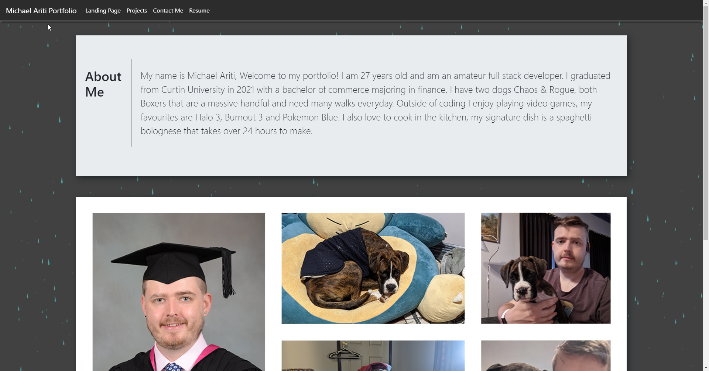

# Homework Week 8 Portfolio Update Michael Ariti

## Portfolio

The purpose of this repository is to create a portfolio for myself that keeps all of my projects in a stylish and central place for potential employers to view.

## Features

1. A landing page including a description of myself.
2. My contact information.
3. My best projects so far with descriptions and screenshots of each.
4. My resume available for download or viewing.

## File Directory

You will find the index.html next to this readme, which is the finished website code.

In the assets folder you will find 
1. The guidelines to this homework
2. The css style sheet for the index.html
3. The screenshot of the finished website which is pictured below.
4. The javascript used to run the dashboard.
5. My Resume

## License

MIT

## Technologies Used

1. HTML5
2. CSS
3. Javascript
4. Photoshop
5. Bootstrap

## Secreenshot

## Webpage URL
[Portfolio-URL](https://michaelfellas.github.io/Portfolio-Update/)

### End

Michael Ariti 2022